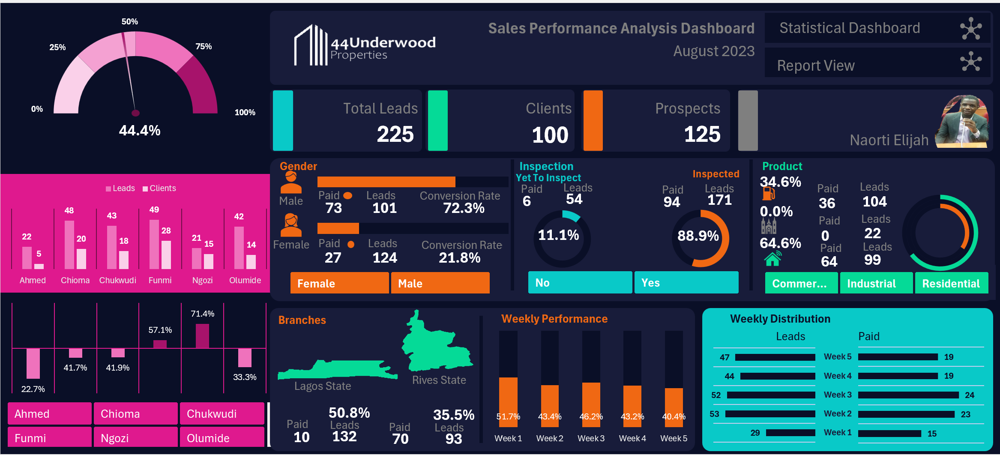
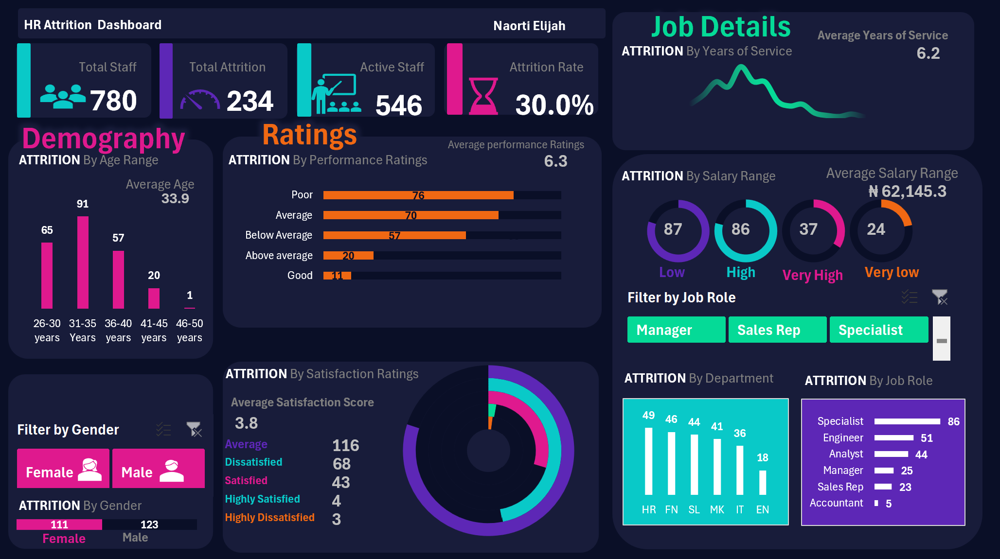
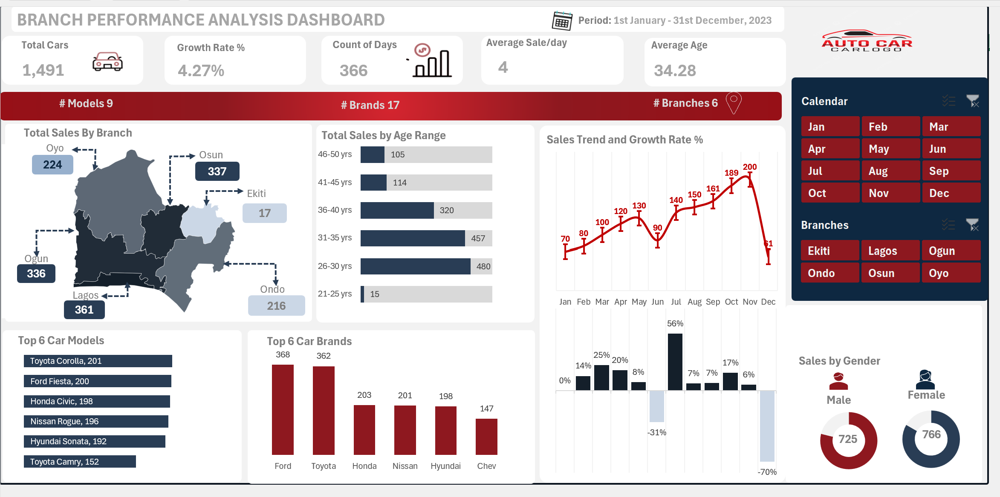
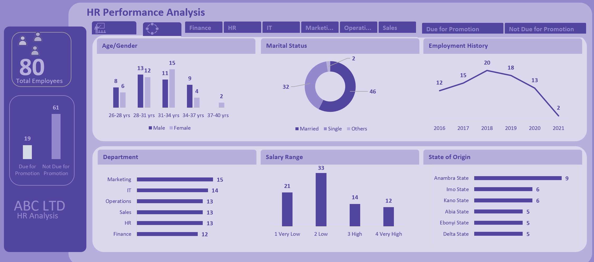

<!--Section 1: Introduce your self-->
## ABOUT ME

I'm Naorti Elijah, a data analyst with a focus on turning complex data into meaningful insights that support business decision-making.
I specialize in data cleaning, analysis, and visualization to identify trends and optimize processes. I have a passion for problem-solving and enjoy collaborating with teams to drive data-driven strategies. My goal is to leverage data to enhance efficiency and guide organizations toward growth and innovation.

<!--Mention your top/relevant skills here - core and solf skills-->
## WHAT I DO

I specialize in collecting, processing, and analyzing large datasets to uncover actionable insights that inform business strategies. My work involves extracting meaningful patterns from data, cleaning and organizing raw information, and delivering reports that help stakeholders make data-driven decisions.

## MY SKILLS
✅Statistical Analysis✅Data Visualization: Using tools like Power BI and Excel✅Data Cleaning and Preparation: Using tools like Excel✅Problem-Solving✅Communication Skills✅Attention to Detail✅Predictive modelling annd forcasting

## MY PORTFOLIO 

*A glimpse of some of the projects I've been working on.*

**Sales Performanance Analysis for Underwood Properties.**

There is a strong negative correlation between female and conversion rate, which means that as female leads increases, there will likely be an associate decrease in the number of payment (CR). [Read More](asset/Sales performance Analysis Report DAMP3.pdf)   
[Click for Excel file](https://1drv.ms/x/c/6bda0c9ec1f0d1ce/EciKlGXj7QJDmzUf6BehA_wBUPwL6xTiqry0RBrRWKlPAg?e=14TVth)

**HR Attrition and Employee Analysis.**

The Performanance and Satisfaction ratings of the people that left the organization is below average and can be predicted that it has a significsnt effected on their emolument, which could be a factor for the attrition. [Excel File](https://1drv.ms/x/c/6bda0c9ec1f0d1ce/EaJvOrGf3DxFr6Y7N3VKysABnojgDicNaCnADGihVRVvDA?e=Gdo54U)

**Sales Performance Analysis for Car Beyond Ltd.**

  asset/HR performance.png

The Company's sales volume and growth rate in 2020 were higher compared to industry averages. Manage resources better by matching demand with product visibility. 
With the increasing demand, we have identified opportunities and proposed strategies for **growth and expansion** [Download PDF file](asset/Car beyond report analysis.pdf)

[Excel File](https://1drv.ms/x/c/6bda0c9ec1f0d1ce/EZOivSJJIg9Hp22KRKlzSgABx_rW942MMi2NjqUpFY6ZdQ?e=LrV0Y9)

**HR Performance Analysis.**

  
The organization should use key performance indicator to determine employess that are due for promotion rather than using the years of service. [Excel File](asset/HR Promotion Analysis.xlsx)

## MY CERTIFICATION
-✅ CISCO: Introduction to Data Science
- ✅Data Analytics Mentorship Program with Excel
- ✅SkillAhead Academy: Data Analytics for Beginners
- ✅Alison: Mastering Data Analysis using MS Exel: Formulas and Pivot Tables✅ Diploma in Cyber Security✅Risk Assessment & Control-Health and Safety✅ Dealing with Difficult Peoplein Life & Work
- 
## CONTACT DETAILS

*Let’s connect and see how we can make a difference together!*
<table>
  <tbody>
    <tr>
      <td>📧</td>
      <td><a href="elijahnaorti65@gmail.com">elijahnaorti65@gmail.com</a></td>
    </tr>
    <tr>
      <td>📞</td>
      <td>(234) 806-520-4065</td>
    </tr>
    <tr>
      <td>📍</td>
      <td>FCT ABUJA, Nigeria</td>
    </tr>
    <tr>
      <td>⬇️</td>
      <td><a href="https://etuk123456.github.io/portfolio1/docs/Profile.pdf">Download my CV</a></td>
    </tr>
    <tr>
      <td>🌐</td>
      <td><a href="https://www.linkedin.com/in/naorti/">The things I do daily on LinkedIn</a></td>
    </tr>
    <tr>
      
    </tr>
  </tbody>
</table>
